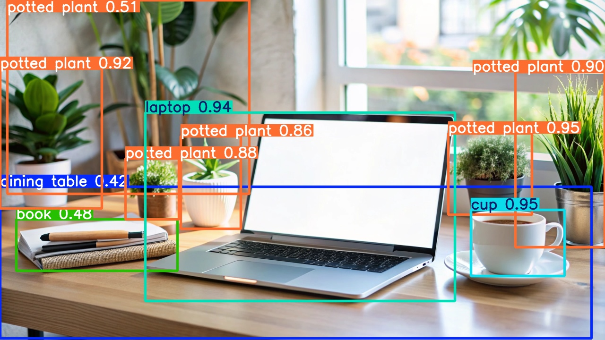
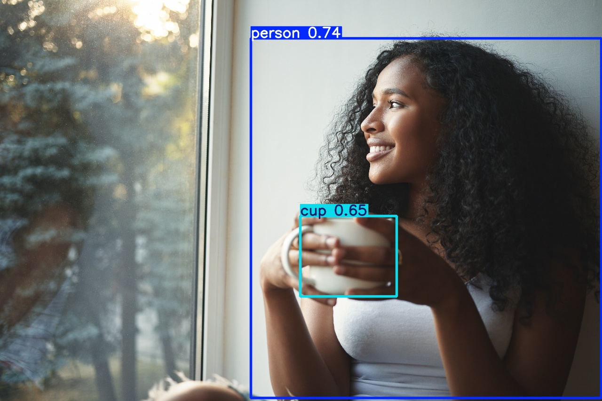

# FluentVision

A fluent PHP 8.3+ API for YOLO object detection powered by [Ultralytics YOLO26](https://docs.ultralytics.com/) and [NanoDet-Plus](https://github.com/RangiLyu/nanodet).

Detect, segment, classify, and annotate images with an elegant chainable interface — same PHP result types regardless of which backend runs inference.

## Quick Start

```bash
composer require b7s/fluentvision
```

```php
use B7s\FluentVision\FluentVision;
use B7s\FluentVision\Enums\Provider;
use B7s\FluentVision\Enums\YoloModel;

$result = FluentVision::make()
    ->useUltralytics()
    ->model(YoloModel::YOLO26s)
    ->useCpu()
    ->conf(0.5)
    ->image('photo.jpg')
    ->detect();

echo $result->getDetectionCount() . " objects found\n";

foreach ($result->detections as $detection) {
    echo sprintf("- %s (%.1f%%)\n", $detection->class, $detection->confidence * 100);
}
```

## Installation

First, install Python dependencies and download models:

```bash
# Install the PHP package
composer require b7s/fluentvision

# Set up Python venv + packages + models
vendor/bin/fluentvision install

# Or install only one provider
vendor/bin/fluentvision install --provider=ultralytics
vendor/bin/fluentvision install --provider=nanodet

# Download a specific model
vendor/bin/fluentvision install --model=yolo26s.pt
vendor/bin/fluentvision install --model=yoloe-26s-seg.pt
vendor/bin/fluentvision install --model=nanodet-plus-m-416
```

Check your environment:

```bash
vendor/bin/fluentvision doctor
```

## Providers

| Provider | Backend | Best For                                                                |
|----------|---------|-------------------------------------------------------------------------|
| **Ultralytics** | YOLO26 (n/s/m/l/x), YOLOE-26 (s/m/l + PF) | Full-featured, multi-task, open-vocabulary detection |
| **NanoDet** | NanoDet-Plus (M/T/G) | Ultra-lightweight, edge devices, real-time                              |

Both providers return identical PHP result types — switch backends without changing your code.

### YOLOE-26 Open-Vocabulary Detection

YOLOE models support **text prompts** to detect anything you can describe — not just the 80 COCO classes:

```php
use B7s\FluentVision\Enums\YoloModel;

$result = FluentVision::make()
    ->useUltralytics()
    ->model(YoloModel::YOLOE26s)
    ->useCpu()
    ->conf(0.25)
    ->prompts(['person', 'yellow hard hat'])
    ->image('factory.jpg')
    ->detect();
```

| Variant | Suffix | Prompts | Best For |
|---------|--------|---------|----------|
| **Text-prompted** | `yoloe-26*-seg.pt` | `->prompts([...])` required | Targeted attribute/concept detection |
| **Prompt-free** | `yoloe-26*-seg-pf.pt` | Not supported | Auto-detect without specifying prompts |

Runs on **CPU** (~0.15s/image). See [Providers doc](docs/providers.md#yoloe-26-open-vocabulary-detection) for details.

## Detection Examples

### Modern Workspace

```php
$result = FluentVision::make()
    ->useUltralytics()
    ->model(YoloModel::YOLO26s)
    ->conf(0.4)
    ->image('modern-workspace-with-laptop-coffee-plants.jpg')
    ->detect();
```



### Person + Cup

```php
$result = FluentVision::make()
    ->useUltralytics()
    ->model(YoloModel::YOLO26s)
    ->conf(0.4)
    ->image('woman-cup-coffe.jpg')
    ->detect();
```



### Street Scene with Segment

```php
$result = FluentVision::make()
    ->useUltralytics()
    ->model(YoloModel::YOLOE26mPF) // Segment with Prompt free
    ->conf(0.4)
    ->image('woman-bike-cars-trees-road-day.jpg')
    ->detect();
// 9 detections: person (90.6%), bicycle (91.2%), 7x car
```


## Detection Result Array

The `detect()` method returns an `InferenceResult` object. Call `toArray()` to get a plain array:

```php
$result->toArray();

// [
//     'image_path' => '/path/to/photo.jpg',
//     'provider' => 'ultralytics',
//     'model' => 'yolo26s.pt',
//     'inference_time' => 0.1367,
//     'detection_count' => 2,
//     'detections' => [
//         [
//             'class' => 'person',
//             'confidence' => 0.910,
//             'box' => ['x1' => 198.0, 'y1' => 242.0, 'x2' => 675.0, 'y2' => 836.0],
//         ],
//         [
//             'class' => 'cup',
//             'confidence' => 0.646,
//             'box' => ['x1' => 638.0, 'y1' => 459.0, 'x2' => 844.0, 'y2' => 630.0],
//         ],
//     ],
// ]
```

## Fluent API

```php
use B7s\FluentVision\FluentVision;
use B7s\FluentVision\Enums\Device;
use B7s\FluentVision\Enums\Provider;
use B7s\FluentVision\Enums\YoloModel;
use B7s\FluentVision\Enums\NanodetModel;
use B7s\FluentVision\Enums\YoloTask;

FluentVision::make()
    ->provider(Provider::Ultralytics) // or ->useUltralytics() / ->useNanodet()
    ->model(YoloModel::YOLO26s) // or ->model('yolo26s.pt') or ->model('/path/to/custom.pt')
    ->useCpu() // or ->useGpu()
    ->conf(0.5) // confidence threshold
    ->iou(0.45) // IoU threshold (NMS)
    ->imgsz(640) // inference image size
    ->maxDet(100) // max detections per image
    ->classes(['person', 'car']) // filter to specific classes
    ->prompts(['person wearing red', 'hard hat']) // YOLOE text prompts
    ->augment() // test-time augmentation
    ->half() // FP16 inference (GPU)
    ->image('/path/to/image.jpg')
    ->detect();
```

### Image Detection

```php
$result = FluentVision::make()
    ->image('photo.jpg')
    ->detect();
```

### Video Detection

```php
$result = FluentVision::make()
    ->video('clip.mp4')
    ->vidStride(5)        // process every 5th frame
    ->detectVideo();

echo $result->getFrameCount() . " frames processed\n";
echo $result->getTotalDetections() . " total detections\n";
```

### Image Annotation

```php
$result = FluentVision::make()
    ->image('photo.jpg')
    ->annotate();

echo "Annotated image saved to: " . $result->annotatedPath . "\n";
```

### Working with Results

```php
$result = FluentVision::make()->image('photo.jpg')->detect();

// Counts
$result->getDetectionCount();
$result->isEmpty();

// Filter detections
$persons = $result->filterByClass('person');
$highConf = $result->filterByMinConfidence(0.8);

// Unique classes
$classes = $result->getClasses();

// Individual detections
foreach ($result->detections as $d) {
    echo $d->class;           // "person"
    echo $d->confidence;      // 0.92
    echo $d->box->x1;         // 100.0
    echo $d->box->width();    // 150.5
    echo $d->box->area();     // 22650.25
}

// Serialize
$data = $result->toArray();
```

### NanoDet Example

```php
use B7s\FluentVision\Enums\NanodetModel;

$result = FluentVision::make()
    ->useNanodet()
    ->model(NanodetModel::PlusM416)
    ->image('photo.jpg')
    ->detect();
```

### Custom Trained Models

Pass a path to your own trained model — provider is auto-inferred from the file extension:

```php
// Ultralytics (.pt, .onnx, .engine, etc.) — auto-detected
$result = FluentVision::make()
    ->model('/path/to/my-trained-model.pt')
    ->image('photo.jpg')
    ->detect();

// NanoDet — use nanodetCustom() for config + checkpoint
$result = FluentVision::make()
    ->nanodetCustom('/path/config.yml', '/path/model.ckpt')
    ->image('photo.jpg')
    ->detect();
```

See [Custom Models](docs/custom-models.md) for full details on supported formats, model resolution, and provider auto-inference.

## Configuration

Create `fluentvision-config.php` in your project root:

```php
<?php

declare(strict_types=1);

return [
    'default_provider'       => 'ultralytics',
    'ultralytics_default_model' => 'yolo26s.pt',
    'nanodet_default_model'  => 'nanodet-plus-m-416',
    'default_device'         => 'cpu',
    'default_conf'           => 0.25,
    'default_iou'            => 0.7,
    'default_imgsz'          => 640,
    'python_path'            => null,           // auto-detect
    'python_venv_path'       => null,           // default: ~/.fluentvision/venv
    'model_dir'              => null,           // default: ~/.fluentvision/models
    'nanodet_repo_path'      => null,           // default: ~/.fluentvision/nanodet
    'timeout'                => 0,              // 0 = no timeout
    'verbose'                => false,
];
```

Or load from a custom path:

```php
$vision = FluentVision::make('/path/to/my-config.php');
```

## CLI Commands

```bash
# Environment check
vendor/bin/fluentvision doctor

# Install all dependencies
vendor/bin/fluentvision install

# Install specific provider
vendor/bin/fluentvision install --provider=ultralytics
vendor/bin/fluentvision install --provider=nanodet

# Download a model
vendor/bin/fluentvision install --model=yolo26m.pt
vendor/bin/fluentvision install --model=nanodet-plus-m-416

# Use custom config
vendor/bin/fluentvision doctor --config=/path/to/config.php
vendor/bin/fluentvision install --config=/path/to/config.php
```

## Requirements

- PHP 8.3+
- Python 3.8+ with pip
- Ultralytics or NanoDet Python packages (installed via `fluentvision install`)

## Documentation

- [Installation Guide](docs/installation.md) — step-by-step setup
- [Configuration Reference](docs/configuration.md) — all config options
- [Usage Guide](docs/usage.md) — complete fluent API reference
- [Providers](docs/providers.md) — Ultralytics vs NanoDet details
- [Custom Models](docs/custom-models.md) — using your own trained models
- [Result Objects](docs/results.md) — InferenceResult, DetectionResult, BoundingBox API
- [CLI Commands](docs/cli.md) — install, doctor, and options

## License

MIT

---

[Image by freepik](https://www.magnific.com/)
