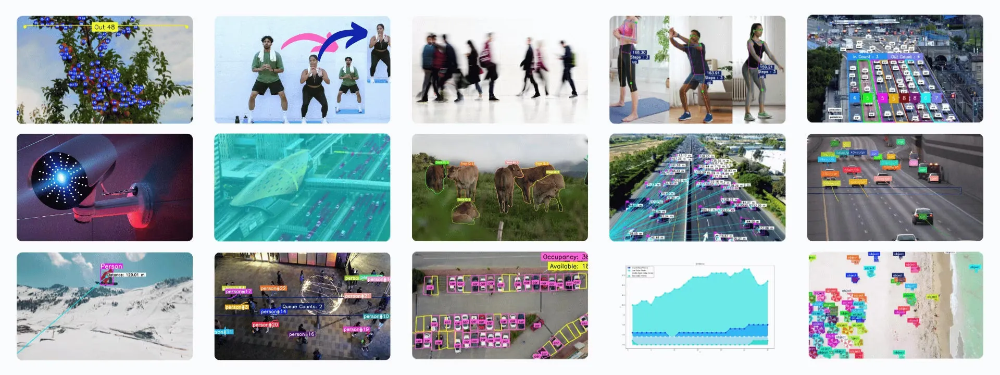

# Ultralytics Solutions



FluentVision provides access to all 12 Ultralytics built-in solutions through a single `solution()` method. Solutions are Ultralytics-only features — they require the Ultralytics provider.

## Quick Start

```php
use B7s\FluentVision\Enums\UltralyticsSolution;
use B7s\FluentVision\FluentVision;

$result = FluentVision::make()
    ->media('/path/to/video.mp4')
    ->solution(UltralyticsSolution::Count)
    ->withAnnotation(true)
    ->process();

echo $result->inCount;   // objects entering region
echo $result->outCount;  // objects exiting region
```

## Available Solutions

| Enum Case | Value | Python Class | Description |
|-----------|-------|-------------|-------------|
| `Count` | `count` | ObjectCounter | Count objects entering/exiting a region |
| `Crop` | `crop` | ObjectCropper | Crop detected objects from frames |
| `Blur` | `blur` | ObjectBlurrer | Blur detected objects in frames |
| `Workout` | `workout` | AIGym | Monitor workout reps and form |
| `Heatmap` | `heatmap` | Heatmap | Generate detection heatmaps |
| `ISegment` | `isegment` | InstanceSegmentation | Instance-level segmentation |
| `VisionEye` | `visioneye` | VisionEye | Map object gaze/direction to a point |
| `Speed` | `speed` | SpeedEstimator | Estimate object speed |
| `Queue` | `queue` | QueueManager | Count objects in a queue region |
| `Analytics` | `analytics` | Analytics | Generate analytics charts |
| `TrackZone` | `trackzone` | TrackZone | Track objects within zones |
| `Distance` | `distance` | DistanceCalculation | Calculate distance between objects |

## Solution-Specific Parameters

Pass extra parameters as an associative array to `solution()`:

```php
->solution(UltralyticsSolution::Heatmap, [
    'region' => '[[20,400],[1080,400],[1080,800],[20,800]]',
    'colormap' => 2,  // OpenCV colormap constant
])
```

### Parameter Reference

| Parameter | Type | Solutions | Description |
|-----------|------|-----------|-------------|
| `region` | string | count, heatmap, queue, trackzone | Region points as JSON array |
| `colormap` | int | heatmap | OpenCV colormap constant (e.g. `cv2.COLORMAP_JET = 2`) |
| `blur_ratio` | float | blur | Blur intensity 0.1–1.0 |
| `crop_dir` | string | crop | Output directory for cropped objects |
| `vision_point` | string | visioneye | Vision point as JSON array e.g. `'[20,20]'` |
| `kpts` | string | workout | Keypoint indices e.g. `'6,8,10'` |
| `up_angle` | float | workout | Angle threshold for "up" position |
| `down_angle` | float | workout | Angle threshold for "down" position |
| `fps` | float | speed | Video FPS for speed calculation |
| `max_hist` | int | speed | Max history points for speed tracking |
| `meter_per_pixel` | float | speed | Scale factor for real-world speed |
| `max_speed` | int | speed | Maximum speed limit (km/h) |
| `analytics_type` | string | analytics | Chart type: `line`, `bar`, `pie`, `area` |
| `json_file` | string | analytics | JSON data file path |
| `records` | int | analytics | Detection count threshold |
| `tracker` | string | all | Tracker config e.g. `botsort.yaml` |

## Solution Examples

### Object Counting

```php
$result = FluentVision::make()
    ->media('/path/to/highway.mp4')
    ->model(YoloModel::YOLO26s)
    ->solution(UltralyticsSolution::Count, [
        'region' => '[[20,400],[1080,400],[1080,800],[20,800]]',
    ])
    ->withAnnotation(true)
    ->process();

echo "In: {$result->inCount}, Out: {$result->outCount}\n";
print_r($result->classwiseCount);
```

### Speed Estimation

```php
$result = FluentVision::make()
    ->media('/path/to/road.mp4')
    ->solution(UltralyticsSolution::Speed, [
        'region' => '[[20,400],[1080,400]]',
        'meter_per_pixel' => 0.05,
        'max_speed' => 120,
    ])
    ->process();

print_r($result->speedDict);  // ['1' => 55.0, '2' => 30.0, ...]
```

### Heatmap

```php
$result = FluentVision::make()
    ->media('/path/to/store.mp4')
    ->solution(UltralyticsSolution::Heatmap, [
        'region' => '[[0,0],[1920,0],[1920,1080],[0,1080]]',
        'colormap' => 2,
    ])
    ->withAnnotation(true)
    ->process();
```

### Workout Monitoring

```php
$result = FluentVision::make()
    ->media('/path/to/workout.mp4')
    ->solution(UltralyticsSolution::Workout, [
        'kpts' => '6,8,10',
        'up_angle' => 145.0,
        'down_angle' => 90.0,
    ])
    ->process();

print_r($result->workoutCount);  // rep counts per track
print_r($result->workoutStage);  // stage per track
```

### Queue Management

```php
$result = FluentVision::make()
    ->media('/path/to/queue.mp4')
    ->solution(UltralyticsSolution::Queue, [
        'region' => '[[100,100],[500,100],[500,500],[100,500]]',
    ])
    ->process();

echo "Queue length: {$result->queueCount}\n";
```

### Object Blurring

```php
$result = FluentVision::make()
    ->media('/path/to/private.mp4')
    ->solution(UltralyticsSolution::Blur, [
        'blur_ratio' => 0.5,
    ])
    ->withAnnotation(true)
    ->process();
```

### Distance Calculation

```php
$result = FluentVision::make()
    ->media('/path/to/scene.mp4')
    ->solution(UltralyticsSolution::Distance)
    ->process();

echo "Distance: {$result->pixelsDistance} pixels\n";
```

### Analytics

```php
$result = FluentVision::make()
    ->media('/path/to/traffic.mp4')
    ->solution(UltralyticsSolution::Analytics, [
        'analytics_type' => 'line',
        'json_file' => '/path/to/data.json',
        'records' => 50,
    ])
    ->process();
```

## Saving Annotated Output

Use `withAnnotation(true)` and optionally `savePath()` to save the annotated video/image:

```php
$result = FluentVision::make()
    ->media('/path/to/video.mp4')
    ->solution(UltralyticsSolution::Count)
    ->withAnnotation(true)
    ->savePath('/tmp/output')
    ->process();

echo $result->annotatedPath;  // /tmp/output/video_solution.avi
```

## Common Options

All solutions support these standard FluentVision options:

- `confidence(float)` — detection confidence threshold
- `iou(float)` — IoU threshold for NMS
- `imgsz(int)` — inference image size
- `classes(array)` — filter to specific class IDs
- `model(YoloModel|string)` — override the default model

```php
$result = FluentVision::make()
    ->media('/path/to/video.mp4')
    ->model(YoloModel::YOLO26s)
    ->confidence(0.5)
    ->classes([0, 2])  // person, car
    ->solution(UltralyticsSolution::Count)
    ->process();
```

## SolutionResult

The `process()` method returns a `SolutionResult` object when a solution is selected:

| Property | Type | Description |
|----------|------|-------------|
| `solution` | string | Solution name |
| `source` | string | Input source path |
| `model` | string | Model used |
| `provider` | string | Always `ultralytics` |
| `frameCount` | int | Number of frames processed |
| `totalTime` | float | Total processing time (seconds) |
| `totalTracks` | ?int | Total tracked objects |
| `inCount` | ?int | Objects entering region (count, heatmap) |
| `outCount` | ?int | Objects exiting region (count, heatmap) |
| `classwiseCount` | array | Per-class in/out counts |
| `queueCount` | ?int | Objects in queue |
| `totalCropObjects` | ?int | Cropped object count |
| `pixelsDistance` | ?float | Distance in pixels |
| `workoutCount` | ?array | Rep counts per track |
| `workoutAngle` | ?array | Angles per track |
| `workoutStage` | ?array | Stages per track |
| `filledSlots` | ?int | Occupied slots |
| `availableSlots` | ?int | Available slots |
| `speedDict` | array | Per-track speeds |
| `emailSent` | ?bool | Whether alert was sent |
| `regionCounts` | array | Per-region counts |
| `annotatedPath` | ?string | Path to annotated output |
| `frames` | array | Per-frame data (video) |

### Result Methods

```php
$result->getFrameCount(): int
$result->getTotalTime(): float
$result->getTotalTracks(): ?int
$result->getInCount(): ?int
$result->getOutCount(): ?int
$result->getClasswiseCount(): array
$result->getQueueCount(): ?int
$result->getTotalCropObjects(): ?int
$result->getPixelsDistance(): ?float
$result->getFilledSlots(): ?int
$result->getAvailableSlots(): ?int
$result->getSpeedDict(): array
$result->isEmailSent(): ?bool
$result->hasAnnotation(): bool
$result->getAnnotatedPath(): ?string
$result->toArray(): array
$result->toJson(): string
```

## Restrictions

- Solutions are **Ultralytics-only** — calling `solution()` with the Nanodet provider throws a `RuntimeException`
- Solutions run via `process()` — there is no separate `detect()` or `annotate()` for solutions
- Video processing is synchronous — the PHP process blocks until all frames are processed

## See Also

- [Ultralytics Solutions Documentation](https://docs.ultralytics.com/solutions/)
- [Usage Guide](usage.md)
- [Results Reference](results.md)
